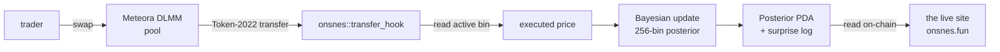

<div align="center">
  

  <h1>Onsnes</h1>
  <p><strong>A Solana token whose price quote is shaped by a piece of math no one alive picked — a Token-2022 transfer hook that holds a Bayesian belief about its own price and updates it on every trade.</strong></p>

  <p>
    <a href="https://onsnesfun.github.io/Onsnes/"></a>
    <a href="https://x.com/Onsnesfun"></a>
    <a href="https://github.com/Onsnesfun/Onsnes"></a>
    <a href="https://github.com/Onsnesfun/Onsnes/releases"></a>
    <a href="https://github.com/Onsnesfun/Onsnes/pkgs/container/onsnes"></a>
    <a href="LICENSE"></a>
  </p>
  <p>
    
    
    
    
    
  </p>
</div>

---

> Every other token on this chain is a **judge** — it decides in advance what the
> "fair price" is and surcharges every trade that disagrees. **Onsnes** is a
> **student**. It does not know the fair price. It starts with an open mind, asks
> the market every block, and when a trade contradicts what it believed it does
> not punish that trade — it lowers its own confidence, writes the correction to
> a public log, and updates. The protocol's growing knowledge is the asset.

## Contents

- [What it is](#what-it-is)
- [Features](#features)
- [How it works](#how-it-works)
- [The mechanism](#the-mechanism)
- [Repository layout](#repository-layout)
- [Quickstart](#quickstart)
- [Build, test & deploy](#build-test--deploy)
- [Notes](#notes)
- [Roadmap](#roadmap)
- [Disclaimers](#disclaimers)
- [Links](#links)

## What it is

Two halves joined by one repo:

| Layer | What | Where |
|-------|------|-------|
| **Face** | The site — the protocol's live belief, charts of what it thinks the price is, its entropy and its corrections. A single static page. | [`index.html`](index.html) |
| **Mind** | A Token-2022 **transfer hook** that maintains a 256-bin Bayesian posterior over price and updates it — by Bayes' theorem, in `i128` fixed-point — on every transfer. | [`programs/onsnes/`](programs/onsnes/) |
| **On-chain** | A posterior PDA and an append-only surprise log, one per mint. No admin, no parameters that can change. | PDAs |

## Features

**The website** (`index.html`)
- 📈 **Belief over price** — a block-by-block heatmap of the posterior with the most-likely-price path threading through it.
- 🔭 **Current belief / knowledge gained / confidence** — the live posterior, bits learned, and a maturity gauge.
- 🧮 **Foundations** — the rule, the history (Bayes → Laplace → Cox → Jaynes), and a plain-language Q&A.
- 🧾 **Corrections** — the append-only log of every moment the protocol admitted it was wrong.
- 🦀 **The Source** — the on-chain Rust program, verbatim.
- 🌑 Pure-black theme · yellow accent · zero build step · portable.

**The program** (`programs/onsnes/`)
- 🎯 256-bin discrete posterior in `i128` fixed-point, normalised to sum to one.
- 🔔 Bayesian update on every transfer: Gaussian likelihood → renormalise → entropy + MAP.
- 📓 On-chain **surprise log** (ring buffer) whenever entropy rises past a threshold.
- 🧊 Entropy floored at **1 bit of irreducible humility**, capped at `log2(BINS)`.
- ⚡ Optional **`lean` build** — 64 bins + a table-lookup Gaussian (no on-chain `exp`) for a tighter compute budget.

## How it works



The hook returns no surcharge — it only updates belief. The site reads the
posterior straight off the chain; nothing is hidden, because there is no one in
here to hide things.

## The mechanism

One line of math, applied after every swap:

```
P(H | E)  =  P(E | H) · P(H) / P(E)
```

The hypothesis `H` is *"the fair price is X"*; the evidence `E` is *"someone just
traded at price Y"*. The protocol multiplies its prior over 256 candidate prices
by a Gaussian likelihood centred on the observed price, renormalises, and
recomputes Shannon entropy and the MAP estimate. It begins life at maximum
ignorance (uniform prior, 8 bits) and sharpens as evidence arrives — never to
certainty, because it caps its own confidence at 1 bit.

## Repository layout

```
Onsnes/
├── index.html              # the site — one self-contained static file
├── Onsnes.png              # logo / favicon
├── programs/onsnes/        # the Solana program (Anchor / Rust)
│   ├── Cargo.toml · Xargo.toml
│   └── src/
│       ├── lib.rs          # instructions, accounts, transfer-hook entrypoint
│       ├── state.rs        # Posterior (256-bin) + SurpriseLog accounts
│       ├── math.rs         # i128 fixed-point: gaussian, exp, log2, entropy, LUT
│       ├── dlmm.rs         # reconstruct executed price from the DLMM pool
│       └── errors.rs
├── tests/onsnes.ts         # end-to-end test
├── migrations/deploy.ts
├── Anchor.toml · Cargo.toml · package.json · tsconfig.json
└── README.md
```

## Quickstart

```bash
git clone https://github.com/Onsnesfun/Onsnes && cd Onsnes

# The face — the site (single static file, no build)
npx serve -l 8080 .          # http://localhost:8080
```

## Build, test & deploy

Build the program on **Linux / macOS / WSL**. Prerequisites:
[Rust](https://rustup.rs/),
[Solana CLI](https://docs.solanalabs.com/cli/install),
[Anchor `0.30.1`](https://www.anchor-lang.com/docs/installation),
Node 18+ and `yarn`.

```bash
yarn install
anchor keys sync                  # write the program id into lib.rs + Anchor.toml
anchor build                      # full 256-bin build + IDL/types
anchor build -- --features lean   # CU-optimised: 64 bins + lookup-table gaussian
anchor test                       # local validator + tests/onsnes.ts

solana config set --url devnet    # or mainnet-beta
anchor deploy
```

Then create a Token-2022 mint with the **TransferHook** extension pointing at the
program, call `initialize(dlmm_pool)` and `initialize_extra_account_meta_list()`,
and set `CONFIG.ca` in `index.html` to the mint to switch the charts to live data.

## Notes

- **Compute budget.** The full 256-bin update + entropy sum per transfer is
  heavy; use the **`lean`** build (64 bins + LUT Gaussian) and raise the swap
  transaction's compute budget.
- **DLMM layout.** `dlmm.rs` reads `active_id` at account offset **76** and
  `bin_step` at **80**, derived from the published Meteora `LbPair` layout
  (`StaticParameters` and `VariableParameters` are 32 bytes each). Verify against
  the deployed pool and add a `10^(decimals_x - decimals_y)` factor for your token.
- **Fixed-point `exp`/`log2`** in `math.rs` are compact polynomial approximations
  tuned to drive the posterior.

## Roadmap

- **Live mode** — point `CONFIG.ca` at the deployed mint; charts run real client-side inference.
- **Compute profiling** — benchmark CU per transfer for the full and lean builds.
- **$ONSNES** — the token, when there is something real to point at.

## Disclaimers

Nothing here is financial advice. Probability is not certainty — the protocol can
be wrong, and says so. Always do your own research.

## Links

- 🌐 Site — https://onsnesfun.github.io/Onsnes/ (→ onsnes.fun)
- 🐦 X — https://x.com/Onsnesfun
- 💻 Source — https://github.com/Onsnesfun/Onsnes

## License

[MIT](LICENSE)
